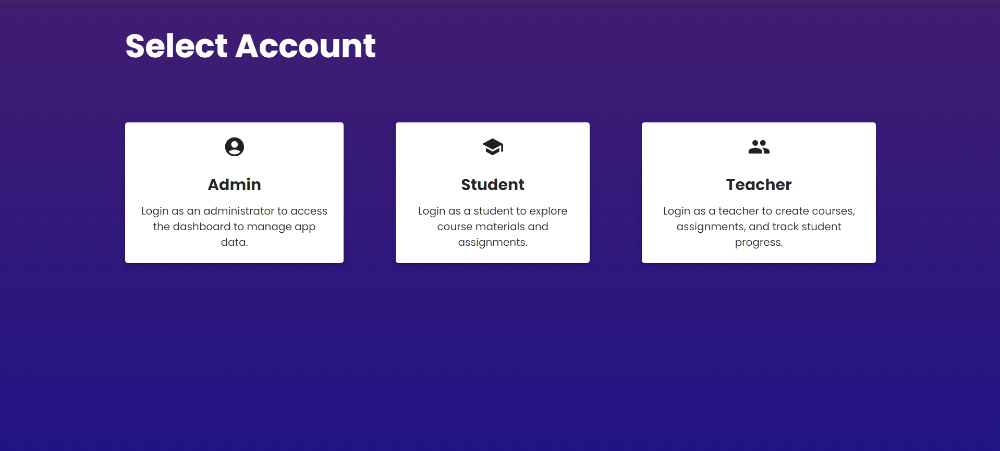
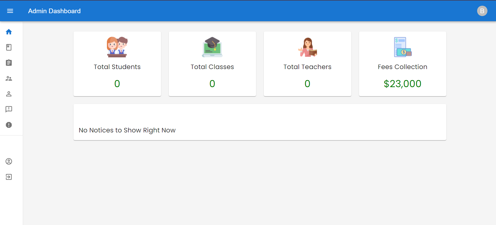
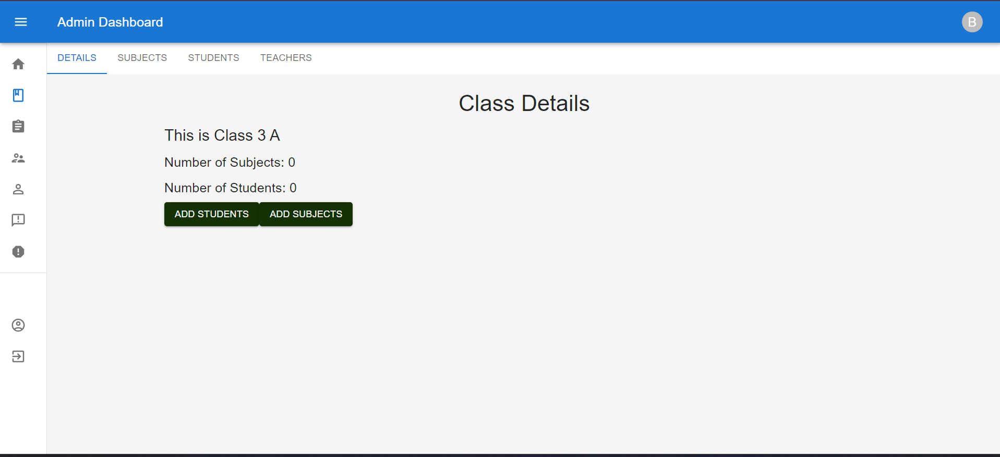
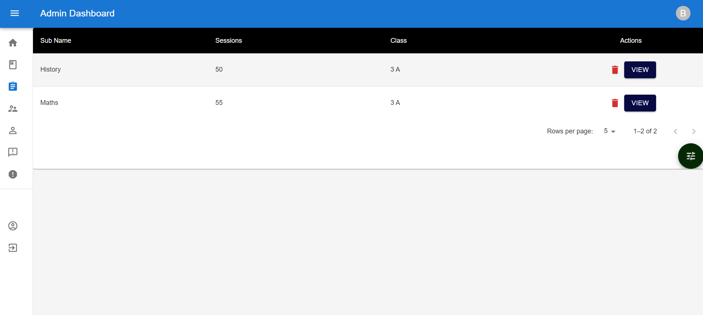
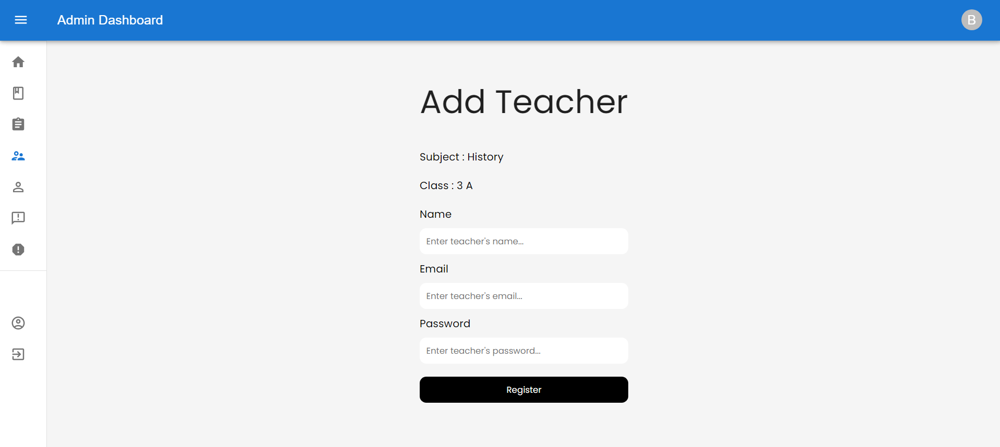
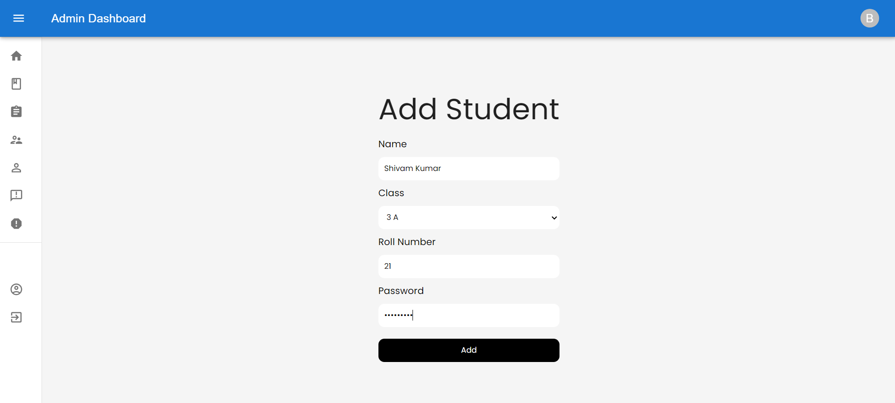
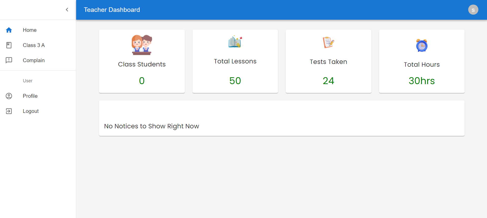
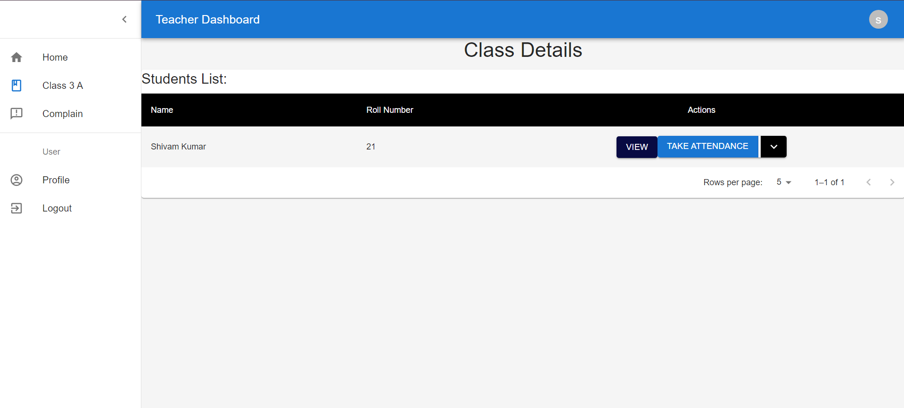
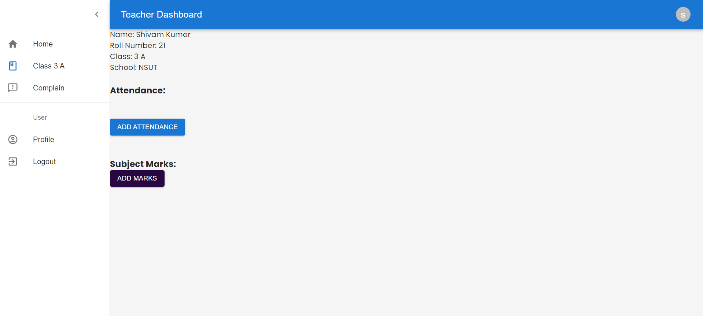

# Shool Management System
School Management System to make school operations smoother and more efficient. This app helps with administrative tasks and improves communication within the school. It includes features like role-based authentication, an admin dashboard, a teacher portal, a student dashboard, attendance management, grade tracking, and sections for notices and complaints.


## Screenshots
Login Page


Role based login 


Admin login Page


Admin Dashboard Page


Admins can add class



Admins can add teacher


Admins can add students


Teacher Dashboard


Teacher can view students profile and can schedule attendance and also upload marks of each students



## Run Locally

Clone the project 

```bash
  git clone git@github.com:BRijesh2001singh/Managment-System.git
```

Install dependencies
```bash
  npm install
```
Docker 
```bash
docker-compose -f docker-compose.prod.yaml up
```
Start the frontend
```bash
npm start
```
Start the server
```bash
  nodemon index.js
```

## Docker
Install docker-compose.yaml file to run locally
```bash
docker compose up
``` 


